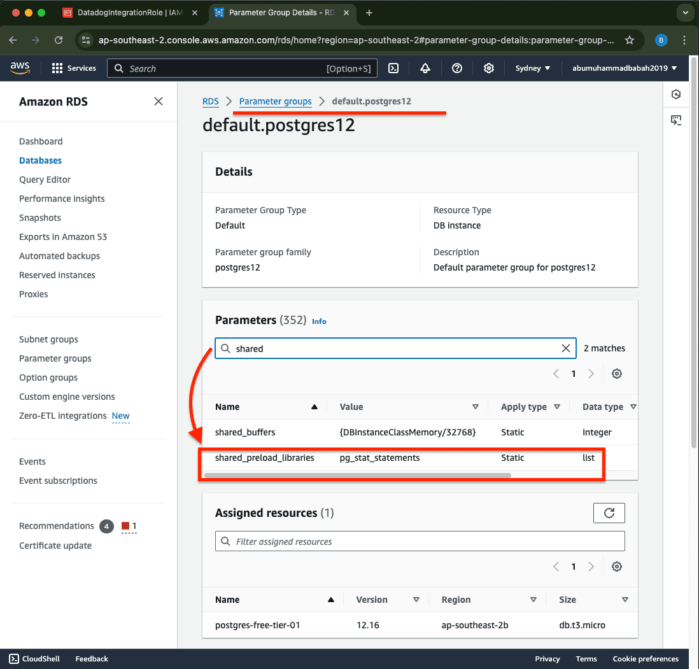
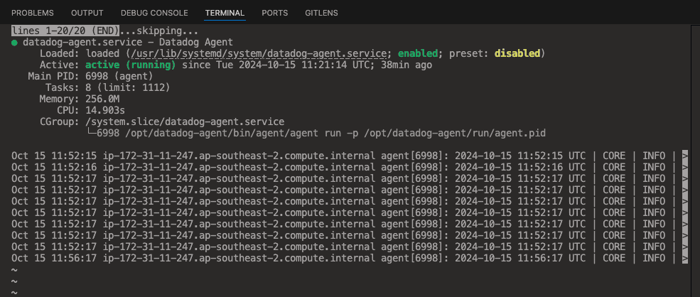

### 🪭 AWS RDS PostgreSQL Monitoring with Datadog APM

🔰 **[ GET STARTED Free 14 Days of unlimited monitoring]** with Datadog 🍀  
&emsp;&emsp;Started: 2024, 14 Oct 16:48 WIB

- **Register:**  
  URL `https://www.datadoghq.com`

  

🟠 Overview - registration (Free Trial)

    

       
       
     
    
 

  

&nbsp;

🍀 **[ Preparation ] restricted-copies:**

🟠 001 - Overview - AWS Billing ( Early start )

 

 

🟠 002 - Overview - AWS RDS - Create Database ✳️

 
   
   
   
   
   
   
   
   
 

 

🟠 003 - Overview - AWS RDS - Modify Configuration Database

 
   
 

 
Notes:  
Modify the public access capability on the database only for testing connected only (before using EC2 instance later).

🟠 004 - Overview - VPC Security Group ( inbound rules ) ✳️ 💰

 
   
   
   
 

 
Notes:  
The inbound setting in the security-group can be removed later after there is a connection between the instance and the rds database. 
This is only for testing rds database access from the outside.

🟠 005 - Overview - DBeaver - Connection Test

 
 

 

&nbsp;

**[ Datadog Account Access ]**  
https://ap1.datadoghq.com

🟠 006 - Overview - Datadog - Login Access Console

 
   
 

 

🟠 007 - Overview - Datadog - Integration ( AWS )

 
   
   
 

 

🟠 008 - Overview - Datadog - Integration - View Documentation ( Site: API )

 
   
⌘ AWS External ID: cc5c44*******************d7aafd0
  

AWS integration IAM policy

<pre>
{
    "Version": "2012-10-17",
    "Statement": [
        {
            "Action": [
                "apigateway:GET",
                "autoscaling:Describe*",
                "backup:List*",
                "budgets:ViewBudget",
                "cloudfront:GetDistributionConfig",
                "cloudfront:ListDistributions",
                "cloudtrail:DescribeTrails",
                "cloudtrail:GetTrailStatus",
                "cloudtrail:LookupEvents",
                "cloudwatch:Describe*",
                "cloudwatch:Get*",
                "cloudwatch:List*",
                "codedeploy:List*",
                "codedeploy:BatchGet*",
                "directconnect:Describe*",
                "dynamodb:List*",
                "dynamodb:Describe*",
                "ec2:Describe*",
                "ec2:GetTransitGatewayPrefixListReferences",
                "ec2:SearchTransitGatewayRoutes",
                "ecs:Describe*",
                "ecs:List*",
                "elasticache:Describe*",
                "elasticache:List*",
                "elasticfilesystem:DescribeFileSystems",
                "elasticfilesystem:DescribeTags",
                "elasticfilesystem:DescribeAccessPoints",
                "elasticloadbalancing:Describe*",
                "elasticmapreduce:List*",
                "elasticmapreduce:Describe*",
                "es:ListTags",
                "es:ListDomainNames",
                "es:DescribeElasticsearchDomains",
                "events:CreateEventBus",
                "fsx:DescribeFileSystems",
                "fsx:ListTagsForResource",
                "health:DescribeEvents",
                "health:DescribeEventDetails",
                "health:DescribeAffectedEntities",
                "kinesis:List*",
                "kinesis:Describe*",
                "lambda:GetPolicy",
                "lambda:List*",
                "logs:DeleteSubscriptionFilter",
                "logs:DescribeLogGroups",
                "logs:DescribeLogStreams",
                "logs:DescribeSubscriptionFilters",
                "logs:FilterLogEvents",
                "logs:PutSubscriptionFilter",
                "logs:TestMetricFilter",
                "oam:ListSinks",
                "oam:ListAttachedLinks",
                "organizations:Describe*",
                "organizations:List*",
                "rds:Describe*",
                "rds:List*",
                "redshift:DescribeClusters",
                "redshift:DescribeLoggingStatus",
                "route53:List*",
                "s3:GetBucketLogging",
                "s3:GetBucketLocation",
                "s3:GetBucketNotification",
                "s3:GetBucketTagging",
                "s3:ListAllMyBuckets",
                "s3:PutBucketNotification",
                "ses:Get*",
                "sns:List*",
                "sns:Publish",
                "sns:GetSubscriptionAttributes",
                "sqs:ListQueues",
                "states:ListStateMachines",
                "states:DescribeStateMachine",
                "support:DescribeTrustedAdvisor*",
                "support:RefreshTrustedAdvisorCheck",
                "tag:GetResources",
                "tag:GetTagKeys",
                "tag:GetTagValues",
                "wafv2:ListLoggingConfigurations",
                "wafv2:GetLoggingConfiguration",
                "xray:BatchGetTraces",
                "xray:GetTraceSummaries"
            ],
            "Effect": "Allow",
            "Resource": "*"
        }
    ]
}
</pre>

 
⌘ Datadog Site: API  
⌘ Account ID Datadog: 417141415827
   

 

🟠 009 - Overview - AWS IAM - Policies ✳️

 
⌘ Create policy (IAM) name: DatadogIntegrationPolicy
 

   
   
   
   
   
   
 

 

🟠 010 - Overview - AWS IAM - Roles ✳️

 
⌘ Create role (IAM) name: DatadogIntegrationRole
 

   
   
   
   
 

 

🟠 011 - Overview - Datadog - Integration ( Continued )

 
  
⌘ AWS Account ID: 730335453692  
 
  
 
🆗 **[Save anyway]**  
   
   
   
 

 

🟠 012 - Overview - Datadog - (Check) Database Monitoring

 
   
   
   
   

 

🟠 013 - Overview - AWS Create Instance ( EC2 ) ✳️

 
   
   
   
   
   
   
 

 

&nbsp;

[ Instance Running State ]  
Public IPv4: 3.107.86.65 
<pre>
[ SSH Connection ]
❯ ssh -i "./Files/datadog-ec2.pem" ec2-user@ec2-3-107-86-65.ap-southeast-2.compute.amazonaws.com
</pre>

-   

[ Test Connection to instance ]

    <pre>
    ❯ ssh -i "./Files/datadog-ec2.pem" ec2-user@ec2-3-107-86-65.ap-southeast-2.compute.amazonaws.com  
    The authenticity of host 'ec2-3-107-86-65.ap-southeast-2.compute.amazonaws.com (3.107.86.65)' can't be established.
    ED25519 key fingerprint is SHA256:7A+t/fzJgVbypjTiCZYYFsatEW+TGQZKmaHINKElRc4.
    This key is not known by any other names
    Are you sure you want to continue connecting (yes/no/[fingerprint])? yes
    Warning: Permanently added 'ec2-3-107-86-65.ap-southeast-2.compute.amazonaws.com' (ED25519) to the list of known hosts.
    @@@@@@@@@@@@@@@@@@@@@@@@@@@@@@@@@@@@@@@@@@@@@@@@@@@@@@@@@@@
    @         WARNING: UNPROTECTED PRIVATE KEY FILE!          @
    @@@@@@@@@@@@@@@@@@@@@@@@@@@@@@@@@@@@@@@@@@@@@@@@@@@@@@@@@@@
    Permissions 0644 for './Files/datadog-ec2.pem' are too open.
    It is required that your private key files are NOT accessible by others.
    This private key will be ignored.
    Load key "./Files/datadog-ec2.pem": bad permissions
    ec2-user@ec2-3-107-86-65.ap-southeast-2.compute.amazonaws.com: Permission denied (publickey,gssapi-keyex,gssapi-with-mic).   
    ❯ chmod 400 ./Files/datadog-ec2.pem   
    ❯ ssh -i "./Files/datadog-ec2.pem" ec2-user@ec2-3-107-86-65.ap-southeast-2.compute.amazonaws.com  
    ,     #_
    ~\_  ####_        Amazon Linux 2023
    ~~  \_#####\
    ~~     \###|
    ~~       \#/ ___   https://aws.amazon.com/linux/amazon-linux-2023
    ~~       V~' '->
        ~~~         /
        ~~._.   _/
            _/ _/
        _/m/'
    [ec2-user@ip-172-31-11-247 ~]$ 
    </pre>
     
    

    

🟠 014 - Overview - Datadog - Install Agent

 
   
   
   
   
 
⌘ [API KEY]: 1ae*************************05d4
<pre>
#AGENT INSTALLATION COMMAND:
❯  DD_API_KEY=1ae*************************05d4 \
   DD_SITE="ap1.datadoghq.com" \
   bash -c "$(curl -L https://install.datadoghq.com/scripts/install_script_agent7.sh)"
</pre>
   
  
 

Full details of installing dd-agent with ssh remote

<pre>
❯ ssh -i "./Files/datadog-ec2.pem" ec2-user@ec2-3-107-86-65.ap-southeast-2.compute.amazonaws.com
   ,     #_
   ~\_  ####_        Amazon Linux 2023
  ~~  \_#####\
  ~~     \###|
  ~~       \#/ ___   https://aws.amazon.com/linux/amazon-linux-2023
   ~~       V~' '->
    ~~~         /
      ~~._.   _/
         _/ _/
       _/m/'
Last login: Tue Oct 15 09:34:55 2024 from 45.251.5.172
[ec2-user@ip-172-31-11-247 ~]$ DD_API_KEY=1ae*************************05d4 \
DD_SITE="ap1.datadoghq.com" \
bash -c "$(curl -L https://install.datadoghq.com/scripts/install_script_agent7.sh)"
  % Total    % Received % Xferd  Average Speed   Time    Time     Time  Current
                                 Dload  Upload   Total   Spent    Left  Speed
100 77366  100 77366    0     0  1711k      0 --:--:-- --:--:-- --:--:-- 1717k  
* Datadog Agent 7 install script v1.35.4  
/usr/bin/systemctl  
* Installing YUM sources for Datadog  
Cache was expired
17 files removed
  Installing package(s): datadog-agent  
Datadog, Inc.                                   7.4 kB/s | 801  B     00:00    
Datadog, Inc.                                    48 kB/s | 1.7 kB     00:00    
Importing GPG key 0xB01082D3:
 Userid     : "Datadog, Inc. RPM key (2023-04-20) (RPM key) <package+rpmkey@datadoghq.com>"
 Fingerprint: 7408 BFD5 6BC5 BF0C 361A AAE8 5D88 EEA3 B010 82D3
 From       : https://keys.datadoghq.com/DATADOG_RPM_KEY_CURRENT.public
Datadog, Inc.                                   1.4 kB/s | 1.7 kB     00:01    
Importing GPG key 0x4F09D16B:
 Userid     : "Datadog, Inc. RPM key (2024-05-15) (RPM key) <package+rpmkey@datadoghq.com>"
 Fingerprint: 2416 A377 57B1 BB02 68B3 634B 52AF C599 4F09 D16B
 From       : https://keys.datadoghq.com/DATADOG_RPM_KEY_4F09D16B.public
Datadog, Inc.                                   1.4 kB/s | 1.7 kB     00:01    
Importing GPG key 0xB01082D3:
 Userid     : "Datadog, Inc. RPM key (2023-04-20) (RPM key) <package+rpmkey@datadoghq.com>"
 Fingerprint: 7408 BFD5 6BC5 BF0C 361A AAE8 5D88 EEA3 B010 82D3
 From       : https://keys.datadoghq.com/DATADOG_RPM_KEY_B01082D3.public
Datadog, Inc.                                   2.0 kB/s | 2.4 kB     00:01    
Importing GPG key 0xFD4BF915:
 Userid     : "Datadog, Inc. RPM key (2020-09-08) <package+rpmkey@datadoghq.com>"
 Fingerprint: C655 9B69 0CA8 82F0 23BD F3F6 3F4D 1729 FD4B F915
 From       : https://keys.datadoghq.com/DATADOG_RPM_KEY_FD4BF915.public
Datadog, Inc.                                   1.3 kB/s | 1.6 kB     00:01    
Importing GPG key 0xE09422B3:
 Userid     : "Datadog, Inc <package@datadoghq.com>"
 Fingerprint: A4C0 B90D 7443 CF6E 4E8A A341 F106 8E14 E094 22B3
 From       : https://keys.datadoghq.com/DATADOG_RPM_KEY_E09422B3.public
Datadog, Inc.                                    48 MB/s |  22 MB     00:00    
Last metadata expiration check: 0:00:05 ago on Tue Oct 15 11:20:14 2024.
Dependencies resolved.
================================================================================
 Package               Architecture   Version             Repository       Size
================================================================================
Installing:
 datadog-agent         x86_64         1:7.57.2-1          datadog         264 M  
Transaction Summary
================================================================================
Install  1 Package  
Total download size: 264 M
Installed size: 264 M
Downloading Packages:
datadog-agent-7.57.2-1.x86_64.rpm                68 MB/s | 264 MB     00:03    
--------------------------------------------------------------------------------
Total                                            68 MB/s | 264 MB     00:03     
Datadog, Inc.                                    51 kB/s | 1.7 kB     00:00    
Importing GPG key 0xB01082D3:
 Userid     : "Datadog, Inc. RPM key (2023-04-20) (RPM key) <package+rpmkey@datadoghq.com>"
 Fingerprint: 7408 BFD5 6BC5 BF0C 361A AAE8 5D88 EEA3 B010 82D3
 From       : https://keys.datadoghq.com/DATADOG_RPM_KEY_CURRENT.public
Key imported successfully
Datadog, Inc.                                    53 kB/s | 1.7 kB     00:00    
Importing GPG key 0x4F09D16B:
 Userid     : "Datadog, Inc. RPM key (2024-05-15) (RPM key) <package+rpmkey@datadoghq.com>"
 Fingerprint: 2416 A377 57B1 BB02 68B3 634B 52AF C599 4F09 D16B
 From       : https://keys.datadoghq.com/DATADOG_RPM_KEY_4F09D16B.public
Key imported successfully
Datadog, Inc.                                    51 kB/s | 1.7 kB     00:00    
GPG key at https://keys.datadoghq.com/DATADOG_RPM_KEY_B01082D3.public (0xB01082D3) is already installed
Datadog, Inc.                                    71 kB/s | 2.4 kB     00:00    
Importing GPG key 0xFD4BF915:
 Userid     : "Datadog, Inc. RPM key (2020-09-08) <package+rpmkey@datadoghq.com>"
 Fingerprint: C655 9B69 0CA8 82F0 23BD F3F6 3F4D 1729 FD4B F915
 From       : https://keys.datadoghq.com/DATADOG_RPM_KEY_FD4BF915.public
Key imported successfully
Datadog, Inc.                                    51 kB/s | 1.6 kB     00:00    
Importing GPG key 0xE09422B3:
 Userid     : "Datadog, Inc <package@datadoghq.com>"
 Fingerprint: A4C0 B90D 7443 CF6E 4E8A A341 F106 8E14 E094 22B3
 From       : https://keys.datadoghq.com/DATADOG_RPM_KEY_E09422B3.public
Key imported successfully
Running transaction check
Transaction check succeeded.
Running transaction test
Transaction test succeeded.
Running transaction
  Preparing        :                                                        1/1 
  Running scriptlet: datadog-agent-1:7.57.2-1.x86_64                        1/1 
  Installing       : datadog-agent-1:7.57.2-1.x86_64                        1/1 
  Running scriptlet: datadog-agent-1:7.57.2-1.x86_64                        1/1 
Enabling service datadog-agent
Created symlink /etc/systemd/system/multi-user.target.wants/datadog-agent.service → /usr/lib/systemd/system/datadog-agent.service.
No datadog.yaml file detected, not starting the agent  
  Verifying        : datadog-agent-1:7.57.2-1.x86_64                        1/1   
Installed:
  datadog-agent-1:7.57.2-1.x86_64   
Complete!  
* Adding your API key to the Datadog Agent configuration: /etc/datadog-agent/datadog.yaml    
* Setting SITE in the Datadog Agent configuration: /etc/datadog-agent/datadog.yaml    
/usr/bin/systemctl
* Starting the Datadog Agent...  
  Your Datadog Agent is running and functioning properly.
  It will continue to run in the background and submit metrics to Datadog.
  If you ever want to stop the Datadog Agent, run:  
      sudo systemctl stop datadog-agent  
  And to run it again run:  
      sudo systemctl start datadog-agent  
[ec2-user@ip-172-31-11-247 ~]$
</pre>

 
<b>⌘ [Start service]</b>
<pre>[ec2-user@ip-172-31-11-247 ~]$ sudo systemctl start datadog-agent</pre> 
<b>⌘ [Status service]</b>
<pre>[ec2-user@ip-172-31-11-247 ~]$ sudo systemctl status datadog-agent</pre>

Overview:

👍🏼 <b>[Done]</b> 👍🏼
 

 

🟠 015 - Overview - Configuration in Instance (EC2) <mark>datadog-ec2-01:</mark>🌟  
&emsp;&emsp;&emsp;&emsp;&emsp;&emsp;⌘ VPC for RDS database and EC2 instance.  
&emsp;&emsp;&emsp;&emsp;&emsp;&emsp;⌘ Setting Up Database Monitoring for self hosted Postgres. 

 
[ Install postgresql ]
<pre>
[ec2-user@ip-172-31-11-247 ~]$ sudo dnf search postgresql15 
</pre>

Response:

<pre>
  Last metadata expiration check: 0:23:08 ago on Tue Oct 15 13:17:01 2024.
  ============================================== Name Exactly Matched: postgresql15 ==============================================
  postgresql15.x86_64 : PostgreSQL client programs
  ================================================== Name Matched: postgresql15 ==================================================
  postgresql15-contrib.x86_64 : Extension modules distributed with PostgreSQL
  postgresql15-docs.x86_64 : Extra documentation for PostgreSQL
  postgresql15-llvmjit.x86_64 : Just-in-time compilation support for PostgreSQL
  postgresql15-plperl.x86_64 : The Perl procedural language for PostgreSQL
  postgresql15-plpython3.x86_64 : The Python3 procedural language for PostgreSQL
  postgresql15-pltcl.x86_64 : The Tcl procedural language for PostgreSQL
  postgresql15-private-devel.x86_64 : PostgreSQL development header files for this build of PostgreSQL server
  postgresql15-private-libs.x86_64 : The shared libraries required only for this build of PostgreSQL server
  postgresql15-server.x86_64 : The programs needed to create and run a PostgreSQL server
  postgresql15-server-devel.x86_64 : PostgreSQL development header files and libraries
  postgresql15-static.x86_64 : Statically linked PostgreSQL libraries
  postgresql15-test.x86_64 : The test suite distributed with PostgreSQL
  postgresql15-test-rpm-macros.noarch : Convenience RPM macros for build-time testing against PostgreSQL server
  postgresql15-upgrade.x86_64 : Support for upgrading from the previous major release of PostgreSQL
  postgresql15-upgrade-devel.x86_64 : Support for build of extensions required for upgrade process
  [ec2-user@ip-172-31-11-247 ~]$ 
</pre>

<pre>
[ec2-user@ip-172-31-11-247 ~]$ sudo dnf install -y postgresql15
</pre>

Response:

<pre>
  Last metadata expiration check: 0:01:52 ago on Tue Oct 15 13:17:01 2024.
  Dependencies resolved.
  =======================================================================================================================
  Package                              Architecture      Version                           Repository              Size
  =======================================================================================================================
  Installing:
  postgresql15                         x86_64            15.8-1.amzn2023.0.1               amazonlinux            1.6 M
  Installing dependencies:
  postgresql15-private-libs            x86_64            15.8-1.amzn2023.0.1               amazonlinux            145 k  
  Transaction Summary
  =======================================================================================================================
  Install  2 Packages  
  Total download size: 1.8 M
  Installed size: 6.9 M
  Downloading Packages:
  (1/2): postgresql15-private-libs-15.8-1.amzn2023.0.1.x86_64.rpm                        2.4 MB/s | 145 kB     00:00    
  (2/2): postgresql15-15.8-1.amzn2023.0.1.x86_64.rpm                                      21 MB/s | 1.6 MB     00:00    
  -----------------------------------------------------------------------------------------------------------------------
  Total                                                                                   14 MB/s | 1.8 MB     00:00     
  Running transaction check
  Transaction check succeeded.
  Running transaction test
  Transaction test succeeded.
  Running transaction
    Preparing        :                                                                                               1/1 
    Installing       : postgresql15-private-libs-15.8-1.amzn2023.0.1.x86_64                                          1/2 
    Installing       : postgresql15-15.8-1.amzn2023.0.1.x86_64                                                       2/2 
    Running scriptlet: postgresql15-15.8-1.amzn2023.0.1.x86_64                                                       2/2 
    Verifying        : postgresql15-15.8-1.amzn2023.0.1.x86_64                                                       1/2 
    Verifying        : postgresql15-private-libs-15.8-1.amzn2023.0.1.x86_64                                          2/2   
  Installed:
    postgresql15-15.8-1.amzn2023.0.1.x86_64             postgresql15-private-libs-15.8-1.amzn2023.0.1.x86_64    
  Complete!
  [ec2-user@ip-172-31-11-247 ~]$   
</pre>

 

🔰 Overview: Setting up connection between RDS databases and EC2 instances

 
   
   
   
   
   
[ Successful outcome ]:
   
   

 

🔰 Documentation: Setting up Database Monitoring for AWS RDS managed postgres

 
 

 

 
<b>[ PostgreSQL Access ]</b>
<pre>
[ec2-user@ip-172-31-11-247 ~] psql -h postgres-free-tier-01.c3eu0imki1jn.ap-southeast-2.rds.amazonaws.com --port 5432 -U postgres
  Password: A#LCZen%dS
</pre>
⌘ [ Grant the Agent access ]:
<pre>
postgres=> \l
                                                 List of databases
   Name    |  Owner   | Encoding |   Collate   |    Ctype    | ICU Locale | Locale Provider |   Access privileges   
-----------+----------+----------+-------------+-------------+------------+-----------------+-----------------------
 postgres  | postgres | UTF8     | en_US.UTF-8 | en_US.UTF-8 |            | libc            | 
 rdsadmin  | rdsadmin | UTF8     | en_US.UTF-8 | en_US.UTF-8 |            | libc            | rdsadmin=CTc/rdsadmin
 template0 | rdsadmin | UTF8     | en_US.UTF-8 | en_US.UTF-8 |            | libc            | =c/rdsadmin          +
           |          |          |             |             |            |                 | rdsadmin=CTc/rdsadmin
 template1 | postgres | UTF8     | en_US.UTF-8 | en_US.UTF-8 |            | libc            | =c/postgres          +
           |          |          |             |             |            |                 | postgres=CTc/postgres
(4 rows) 
postgres=>
</pre>

 

⌘ [ Create the datadog user ]:
<pre>
postgres=> CREATE USER datadog WITH password 'UPY5LKjr8';
CREATE ROLE
postgres=>
</pre>
⌘ [ Create the following schema in every database ]:
<pre>
postgres=> CREATE SCHEMA datadog;
GRANT USAGE ON SCHEMA datadog TO datadog;
GRANT USAGE ON SCHEMA public TO datadog;
GRANT pg_monitor TO datadog;
CREATE EXTENSION IF NOT EXISTS pg_stat_statements schema public;
CREATE SCHEMA
GRANT
GRANT
GRANT ROLE
CREATE EXTENSION
postgres=> 
</pre>
⌘ [ Create the function in every database to enable the Agent to collect explain plans. ] 
<pre>
postgres=> CREATE OR REPLACE FUNCTION datadog.explain_statement(
   l_query TEXT,
   OUT explain JSON
)
RETURNS SETOF JSON AS
$$
DECLARE
curs REFCURSOR;
plan JSON;  
BEGIN
   OPEN curs FOR EXECUTE pg_catalog.concat('EXPLAIN (FORMAT JSON) ', l_query);
   FETCH curs INTO plan;
   CLOSE curs;
   RETURN QUERY SELECT plan;
END;
$$
LANGUAGE 'plpgsql'
RETURNS NULL ON NULL INPUT
SECURITY DEFINER;
CREATE FUNCTION
postgres=>
</pre>
⌘ [ Verify ] 
<pre>
postgres=> \q  
psql -h postgres-free-tier-01.c3eu0imki1jn.ap-southeast-2.rds.amazonaws.com --port 5432 -U datadog postgres -A \
  -c "select * from pg_stat_database limit 1;" \
  && echo -e "\e[0;32mPostgres connection - OK\e[0m" \
  || echo -e "\e[0;31mCannot connect to Postgres\e[0m"
psql -h postgres-free-tier-01.c3eu0imki1jn.ap-southeast-2.rds.amazonaws.com --port 5432 -U datadog postgres -A \
  -c "select * from pg_stat_activity limit 1;" \
  && echo -e "\e[0;32mPostgres pg_stat_activity read OK\e[0m" \
  || echo -e "\e[0;31mCannot read from pg_stat_activity\e[0m"
psql -h postgres-free-tier-01.c3eu0imki1jn.ap-southeast-2.rds.amazonaws.com --port 5432 -U datadog postgres -A \
  -c "select * from pg_stat_statements limit 1;" \
  && echo -e "\e[0;32mPostgres pg_stat_statements read OK\e[0m" \
  || echo -e "\e[0;31mCannot read from pg_stat_statements\e[0m"  
Password for user datadog: UPY5LKjr8
datid|datname|numbackends|xact_commit|xact_rollback|blks_read|blks_hit|tup_returned|tup_fetched|tup_inserted|tup_updated|tup_deleted|conflicts|temp_files|temp_bytes|deadlocks|checksum_failures|checksum_last_failure|blk_read_time|blk_write_time|stats_reset
0||0|0|0|104|462910|245452|154160|30|29|3|0|0|0|0|0||0|0|2023-09-20 02:19:13.878017+00
(1 row)
Postgres connection - OK  
Password for user datadog: UPY5LKjr8
datid|datname|pid|usesysid|usename|application_name|client_addr|client_hostname|client_port|backend_start|xact_start|query_start|state_change|wait_event_type|wait_event|state|backend_xid|backend_xmin|query|backend_type
||712|10|rdsadmin|||||2024-10-14 15:29:12.294311+00||||Activity|LogicalLauncherMain|||||logical replication launcher
(1 row)
Postgres pg_stat_activity read OK  
Password for user datadog: UPY5LKjr8
userid|dbid|queryid|query|calls|total_time|min_time|max_time|mean_time|stddev_time|rows|shared_blks_hit|shared_blks_read|shared_blks_dirtied|shared_blks_written|local_blks_hit|local_blks_read|local_blks_dirtied|local_blks_written|temp_blks_read|temp_blks_written|blk_read_time|blk_write_time
10|16384|-532488427722366057|MOVE -795 IN "query-cursor_1"|1|0.023062|0.023062|0.023062|0.023062|0|0|0|0|0|0|0|0|0|0|0|0|0|0
(1 row)
Postgres pg_stat_statements read OK
</pre>
 
⌘ Configure the Agent ==> [ To configure collecting Database Monitoring metrics for an Agent running on a host, for example when you provision a small EC2 instance for the Agent to collect from an RDS database ]:
<pre>
[ec2-user@ip-172-31-11-247 ~]$ cd /etc/datadog-agent/  
[ec2-user@ip-172-31-11-247 datadog-agent]$ ls -lah
total 400K
drwxr-xr-x.   7 dd-agent dd-agent  16K Oct 15 11:21 .
drwxr-xr-x.  78 root     root      16K Oct 15 13:18 ..
-rw-------.   1 dd-agent dd-agent   64 Oct 15 11:21 auth_token
drwxr-xr-x.   2 dd-agent dd-agent    6 Sep 24 07:30 checks.d
drwxr-xr-x.   2 dd-agent dd-agent  16K Oct 15 11:21 compliance.d
drwxr-xr-x. 211 dd-agent dd-agent  16K Oct 15 11:20 conf.d
-rw-r-----.   1 dd-agent dd-agent 154K Oct 15 11:21 datadog.yaml
-rw-r--r--.   1 dd-agent dd-agent 154K Sep 24 07:30 datadog.yaml.example
-rw-r--r--.   1 root     root        0 Oct 15 11:21 environment
-rw-r--r--.   1 dd-agent dd-agent  119 Oct 15 11:21 install.json
-rw-r--r--.   1 dd-agent dd-agent  125 Oct 15 11:21 install_info
drwxr-xr-x.   2 dd-agent dd-agent   28 Oct 15 11:21 runtime-security.d
-r--r-----.   1 dd-agent dd-agent  835 Sep 24 07:30 security-agent.yaml.example
drwxr-xr-x.   2 dd-agent dd-agent   36 Oct 15 11:21 selinux
-r--r-----.   1 dd-agent dd-agent 7.2K Sep 24 07:30 system-probe.yaml.example  
[ec2-user@ip-172-31-11-247 datadog-agent]$ ls -lah conf.d/ | grep postgres.d
drwxr-xr-x.   2 dd-agent dd-agent  31 Oct 15 11:21 postgres.d  
[ec2-user@ip-172-31-11-247 datadog-agent]$ sudo touch conf.d/postgres.d/conf.yaml
</pre>

📑 [ Monitoring one database on one database host ]
   
📑 [ Monitor multiple databases on multiple database hosts ]
   

<pre>
[ec2-user@ip-172-31-11-247 datadog-agent]$ cd conf.d/postgres.d/ 
[ec2-user@ip-172-31-11-247 postgres.d]$ ls -lah
total 68K
drwxr-xr-x.   2 dd-agent dd-agent   64 Oct 15 15:31 .
drwxr-xr-x. 211 dd-agent dd-agent  16K Oct 15 11:20 ..
-rw-r--r--.   1 dd-agent dd-agent  41K Sep 24 07:30 conf.yaml.example
</pre>
<pre>
[ec2-user@ip-172-31-11-247 postgres.d]$ sudo vim conf.yaml
. . .
init_config:
instances:
  - dbm: true
    host: postgres-free-tier-01.c3eu0imki1jn.ap-southeast-2.rds.amazonaws.com
    port: 5432
    username: datadog
    password: UPY5LKjr8
    tags:
      - "dbinstanceidentifier:postgres-free-tier-01"
</pre>
<pre>
[ec2-user@ip-172-31-11-247 postgres.d]$ sudo systemctl restart datadog-agent
[ec2-user@ip-172-31-11-247 postgres.d]$ sudo systemctl status datadog-agent
● datadog-agent.service - Datadog Agent
     Loaded: loaded (/usr/lib/systemd/system/datadog-agent.service; enabled; preset: disabled)
     Active: active (running) since Tue 2024-10-15 15:54:14 UTC; 4s ago
   Main PID: 77524 (agent)
      Tasks: 11 (limit: 1112)
     Memory: 110.1M
        CPU: 1.505s
     CGroup: /system.slice/datadog-agent.service
             └─77524 /opt/datadog-agent/bin/agent/agent run -p /opt/datadog-agent/run/agent.pid  
Oct 15 15:54:16 ip-172-31-11-247.ap-southeast-2.compute.internal agent[77524]: 2024-10-15 15:54:16 UTC | CORE | INFO | (pkg/collector/worker/check_logger.go:40 in CheckStarted) | check:postgres | Running check...
Oct 15 15:54:16 ip-172-31-11-247.ap-southeast-2.compute.internal agent[77524]: 2024-10-15 15:54:16 UTC | CORE | INFO | (pkg/collector/worker/check_logger.go:40 in CheckStarted) | check:ntp | Running check...
Oct 15 15:54:16 ip-172-31-11-247.ap-southeast-2.compute.internal agent[77524]: 2024-10-15 15:54:16 UTC | CORE | INFO | (pkg/collector/worker/check_logger.go:59 in CheckFinished) | check:ntp | Done running check
Oct 15 15:54:16 ip-172-31-11-247.ap-southeast-2.compute.internal agent[77524]: 2024-10-15 15:54:16 UTC | CORE | INFO | (pkg/util/containers/metrics/provider/registry.go:101 in collectorDiscovery) | Container metrics provide>
Oct 15 15:54:16 ip-172-31-11-247.ap-southeast-2.compute.internal agent[77524]: 2024-10-15 15:54:16 UTC | CORE | INFO | (pkg/collector/python/datadog_agent.go:144 in LogMessage) | postgres:52ee42b33bbd1482 | (utils.py:313) |>
Oct 15 15:54:16 ip-172-31-11-247.ap-southeast-2.compute.internal agent[77524]: 2024-10-15 15:54:16 UTC | CORE | INFO | (pkg/collector/python/datadog_agent.go:144 in LogMessage) | postgres:52ee42b33bbd1482 | (utils.py:313) |>
[ec2-user@ip-172-31-11-247 postgres.d]$ 
</pre>
 

🟠 016 - Overview - Datadog - (Ready) Database Monitoring 

 
   
   
   
 

 

🟠 017 - Overview - (Savings) AWS Billing

 
   
   
   
 

 

&nbsp;

&nbsp;