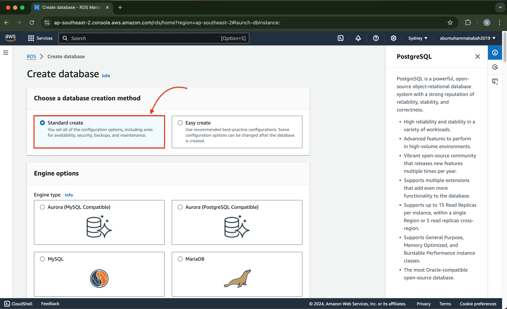

### 🪭 AWS RDS PostgreSQL Monitoring with Datadog APM

🔰 **[ GET STARTED Free 14 Days of unlimited monitoring]** with Datadog 🀠 
&emsp;&emsp;Started: 2024, 14 Oct 16:48 WIB

- **Register:**  
  URL `https://www.datadoghq.com`

  

🟠 Overview - registration (Free Trial)

    

       
       
     
    
 

  

&nbsp;

🍀 **[ Preparation ] restricted-copies:**

🟠 001 - Overview - AWS Billing ( Early start )

 

 

🟠 002 - Overview - AWS RDS - Create Database ✳️

 
   
   
   
   
   
   
   
   
 

 

🟠 003 - Overview - AWS RDS - Modify Configuration Database

 
   
 

 
Notes:  
Modify the public access capability on the database only for testing connected only (before using EC2 instance later).

🟠 004 - Overview - VPC Security Group ( inbound rules ) ✳️ 💰

 
   
   
   
 

 
Notes:  
The inbound setting in the security-group can be removed later after there is a connection between the instance and the rds database. 
This is only for testing rds database access from the outside.

